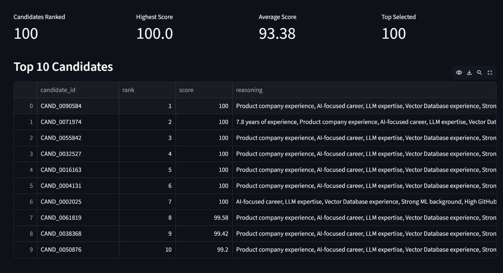
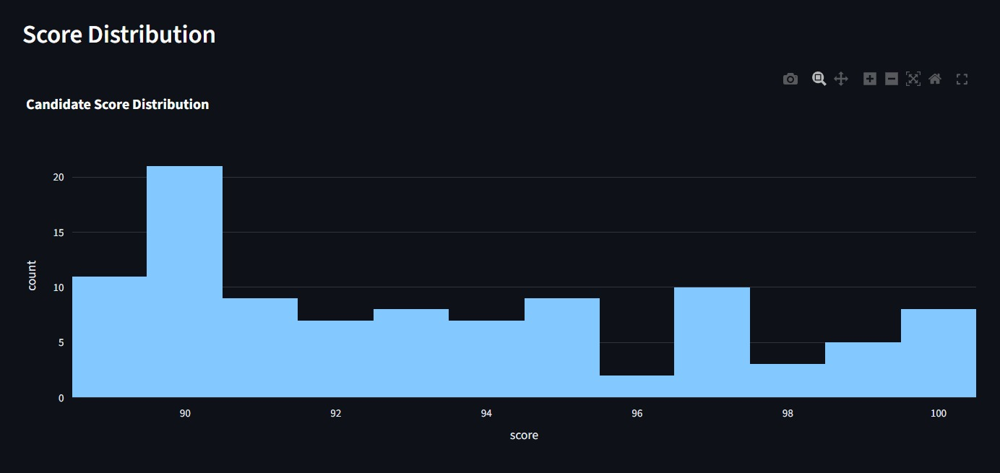
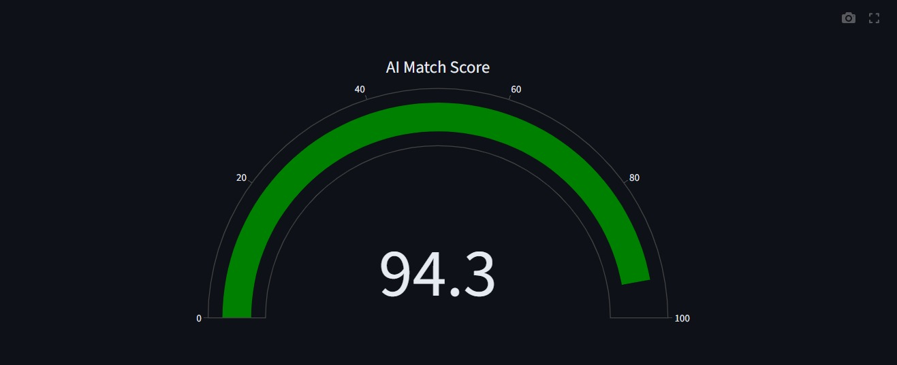
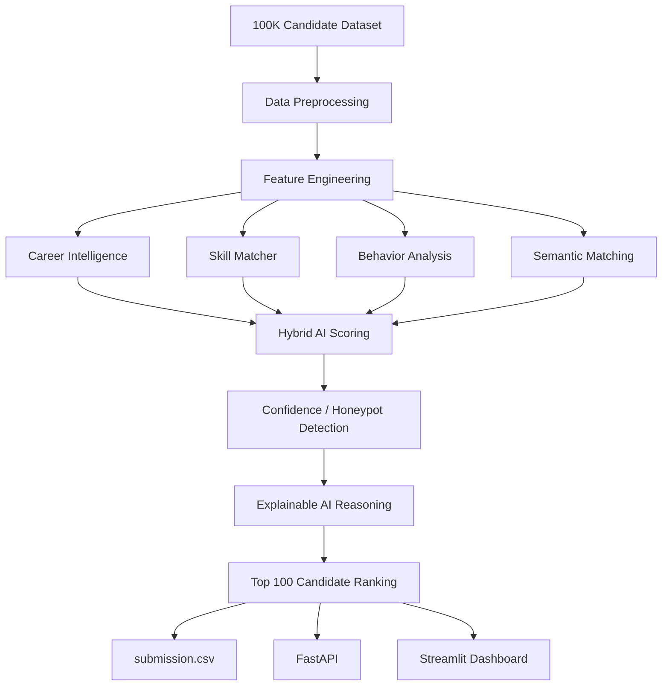

# TalentIQ AI - RDV36

### AI-Powered Candidate Ranking & Explainable Hiring System

> Built for the Redrob AI Hiring Challenge 2026

An intelligent recruitment system that understands candidates beyond keywords by combining semantic skill matching, career intelligence, behavioral analysis, confidence scoring, and explainable AI.


### Explainable AI-Powered Candidate Ranking System


---

## 🚀 AI-Powered Intelligent Candidate Ranking

TalentIQ AI is an advanced recruitment intelligence platform designed to identify the **Top 100 candidates** from a dataset of **100,000+ profiles**.

Unlike traditional ATS systems that rely primarily on keyword matching, TalentIQ AI evaluates candidates using a hybrid AI pipeline that combines:

- 🧠 Semantic Skill Matching
- 📈 Career Progression Intelligence
- 👨‍💻 Behavioral Signal Analysis
- 🛡️ Honeypot & Confidence Detection
- ⭐ Explainable AI Reasoning
- 📊 Hybrid Weighted Candidate Scoring

The system provides recruiters with transparent, explainable, and data-driven hiring recommendations while maintaining high scalability through streaming data processing.

---

## 📸 Project Preview

> **(Replace these placeholders after deployment.)**

| Dashboard | Candidate Details |
|-----------|-------------------|
|  |

| API Documentation | Ranking Results |
|-------------------|-----------------|
|  |  |

# 📖 Project Overview

TalentIQ AI is a scalable AI-powered candidate ranking platform built for the **Redrob AI Hiring Challenge 2026**.

The platform processes over **100,000 candidate profiles** and intelligently identifies the **Top 100 candidates** using a multi-stage evaluation pipeline.

Instead of relying solely on keyword matching, TalentIQ AI analyzes:

- Professional experience
- AI & ML skills
- Career progression
- Recruiter engagement
- Behavioral indicators
- Semantic understanding of skills
- Explainable AI reasoning

The final output is a ranked list of candidates accompanied by transparent explanations, enabling recruiters to make faster and more informed hiring decisions.

---
# 🎯 Problem Statement

Modern recruitment platforms often depend on simple keyword matching and manual resume screening. While these methods are easy to implement, they introduce several limitations:

- ❌ High-quality candidates may be overlooked if they do not use exact keyword matches.
- ❌ Similar technologies (e.g., TensorFlow and PyTorch) are often treated as unrelated skills.
- ❌ Career growth, recruiter engagement, and practical experience are rarely considered.
- ❌ Manual evaluation becomes impractical when processing large candidate datasets.
- ❌ Traditional ranking systems provide little or no explanation behind their recommendations.

For organizations hiring AI and Machine Learning professionals, these limitations increase recruitment time and reduce hiring accuracy.

The challenge was to build an intelligent AI-powered system capable of processing more than **100,000 candidate profiles**, evaluating them holistically, and generating an explainable ranking of the **Top 100 candidates**.
# 💡 Our Solution

TalentIQ AI addresses these challenges through a modular AI ranking pipeline that evaluates candidates from multiple perspectives instead of relying solely on keyword frequency.

The system performs the following stages:

1. Data preprocessing and normalization
2. Feature engineering
3. Career progression analysis
4. AI skill evaluation
5. Semantic skill matching
6. Behavioral signal analysis
7. Confidence & suspicious profile detection
8. Hybrid weighted scoring
9. Explainable AI recommendation generation
10. Top 100 candidate selection

Each module contributes meaningful information to the final ranking, producing a transparent and recruiter-friendly hiring recommendation.

The result is an explainable, scalable, and extensible recruitment intelligence platform capable of processing large candidate datasets efficiently.
# 🌟 Why TalentIQ AI?

TalentIQ AI is designed to move beyond conventional Applicant Tracking Systems (ATS) by understanding candidates holistically rather than relying on keyword counts alone.

## Traditional ATS

- Keyword matching only
- Limited understanding of related technologies
- No career progression analysis
- No behavioral insights
- No explanation behind rankings
- Difficult to trust ranking decisions

## TalentIQ AI

- Hybrid AI-based candidate evaluation
- Semantic understanding of AI technologies
- Career intelligence engine
- Recruiter behavioral signal analysis
- Confidence scoring for profile quality
- Explainable AI recommendations
- Modular and scalable architecture
- Streaming support for large datasets
- Interactive recruiter dashboard
- REST API for integration

TalentIQ AI provides recruiters with both **accurate rankings** and **clear reasoning**, enabling faster and more informed hiring decisions.
# ✨ Key Features

## 🧠 Intelligent Candidate Ranking

Ranks candidates using a hybrid AI scoring engine that evaluates technical skills, experience, recruiter engagement, and career progression.

---

## 🔍 Semantic Skill Matching

Groups related AI technologies together to understand candidate expertise beyond exact keyword matching.

Examples include:

- TensorFlow ↔ Deep Learning
- LangChain ↔ LLM Applications
- Pinecone ↔ Vector Databases
- Hugging Face ↔ Transformers

---

## 📈 Career Intelligence

Analyzes:

- Career growth
- AI-focused experience
- Product company exposure
- Industry transitions
- Experience consistency

---

## 👨‍💻 Behavioral Analysis

Evaluates recruiter interaction signals such as:

- GitHub activity
- Recruiter saves
- Interview completion
- Recruiter response rate
- Notice period

---

## 🛡️ Confidence & Honeypot Detection

Identifies suspicious candidate profiles by analyzing inconsistencies between claimed skills, experience, endorsements, and recruiter signals.

---

## ⭐ Explainable AI

Every recommended candidate is accompanied by a concise explanation describing the primary factors contributing to their ranking.

---

## ⚡ High Performance

- Streaming candidate processing
- Memory-efficient Top-K ranking
- CPU-only execution
- Scalable architecture

---

## 📊 Interactive Dashboard

Streamlit dashboard providing:

- Candidate leaderboard
- Score distribution
- Candidate explorer
- Explainable recommendations
- AI match visualization

---

## 🔌 REST API

FastAPI backend exposes ranking results for integration with external recruitment systems.
# 🏗️ System Architecture



---

## Architecture Overview

TalentIQ AI follows a modular architecture where every AI component is independent and reusable.

Each candidate passes through multiple intelligent evaluation stages before receiving a final score.

This modular design allows new scoring modules to be integrated without affecting the existing pipeline.

---
# 🔄 AI Pipeline


---

## Pipeline Explanation

### Step 1 — Data Preprocessing

- Clean missing values
- Normalize company names
- Normalize AI skills
- Normalize locations

---

### Step 2 — Feature Engineering

Extracts meaningful attributes such as:

- Experience
- Current title
- Education
- Skill counts
- AI expertise
- Career history

---

### Step 3 — Career Intelligence

Measures

- AI experience
- Product company experience
- Career growth
- Stability

---

### Step 4 — Skill Intelligence

Computes

- AI skill score
- LLM expertise
- Cloud skills
- Vector database knowledge

---

### Step 5 — Behavioral Intelligence

Evaluates

- Recruiter interest
- GitHub activity
- Interview completion
- Notice period

---

### Step 6 — Semantic Matching

Recognizes related AI technologies beyond exact keyword matching.

---

### Step 7 — Confidence Detection

Detects suspicious candidate profiles using multiple heuristics.

---

### Step 8 — Explainable AI

Generates recruiter-friendly reasoning describing why a candidate achieved a high ranking.

---
# 📂 Project Structure

```text
TalentIQ-AI/
│
├── api/
│   └── main.py
│
├── data/
│   ├── candidates.jsonl
│   └── job_descriptions.json
│
├── docs/
│   └── images/
│
├── frontend/
│   └── app.py
│
├── models/
│   └── .gitkeep
│
├── output/
│   └── .gitkeep
│
├── src/
│   ├── behavioral_score.py
│   ├── career_analyzer.py
│   ├── config.py
│   ├── feature_engineering.py
│   ├── honeypot_detector.py
│   ├── loader.py
│   ├── preprocess.py
│   ├── reasoning.py
│   ├── scorer.py
│   ├── semantic_match.py
│   └── skill_matcher.py
│
├── Dockerfile
├── docker-compose.yml
├── rank.py
├── requirements.txt
├── README.md
├── LICENSE
├── submission.csv
└── .gitignore
```

---
# 🛠 Technology Stack

| Category | Technology |
|----------|------------|
| Programming Language | Python 3.13 |
| Frontend | Streamlit |
| Backend API | FastAPI |
| Data Processing | Pandas |
| Visualization | Plotly |
| AI Pipeline | Custom Hybrid AI |
| Candidate Ranking | Heap-based Top-K Selection |
| Deployment | Docker |
| Version Control | Git & GitHub |
| Operating System | Windows / Linux |

---

## Core Python Libraries

- FastAPI
- Streamlit
- Pandas
- Plotly
- NumPy
- Uvicorn
- heapq
- dataclasses
- typing

---
# 🛠 Technology Stack

| Category | Technology |
|----------|------------|
| Programming Language | Python 3.13 |
| Frontend | Streamlit |
| Backend API | FastAPI |
| Data Processing | Pandas |
| Visualization | Plotly |
| AI Pipeline | Custom Hybrid AI |
| Candidate Ranking | Heap-based Top-K Selection |
| Deployment | Docker |
| Version Control | Git & GitHub |
| Operating System | Windows / Linux |

---

## Core Python Libraries

- FastAPI
- Streamlit
- Pandas
- Plotly
- NumPy
- Uvicorn
- heapq
- dataclasses
- typing

---
# ▶️ Running the Project

TalentIQ AI consists of three main components.

---

## Step 1 — Generate Rankings

```bash
python rank.py
```

This processes the complete candidate dataset and generates:

```
submission.csv
```

containing the Top 100 ranked candidates.

---

## Step 2 — Launch FastAPI

```bash
uvicorn api.main:app --reload
```

Open:

```
http://127.0.0.1:8000/docs
```

to access the interactive Swagger API.

---

## Step 3 — Launch Streamlit Dashboard

```bash
streamlit run frontend/app.py
```

Dashboard:

```
http://localhost:8501
```

---

# 🐳 Docker Deployment

TalentIQ AI is fully containerized using Docker.

## Build Docker Image

```bash
docker build -t talentiq-ai .
```

---

## Run Container

```bash
docker run -p 8501:8501 talentiq-ai
```

---

The dashboard will be available at

```
http://localhost:8501
```

---

# 🌐 REST API

TalentIQ AI exposes REST APIs using FastAPI.

| Endpoint | Description |
|-----------|-------------|
| `/` | API Status |
| `/health` | Health Check |
| `/top100` | Returns Top 100 Candidates |
| `/candidate/{id}` | Candidate Details |
| `/statistics` | Ranking Statistics |

---

## Swagger UI

```
http://127.0.0.1:8000/docs
```

---
# 🖥️ Recruiter Dashboard

The Streamlit dashboard provides recruiters with an interactive interface for exploring AI-generated candidate rankings.

## Dashboard Features

- 📊 Candidate Leaderboard
- 📈 Score Distribution
- 🧠 Explainable AI Recommendations
- 🔍 Candidate Explorer
- 📉 AI Match Gauge
- 📋 Recruiter Summary
- 📊 Ranking Analytics

---

## Dashboard Preview

> Replace these placeholders after deployment.

### Home Dashboard

```
docs/images/dashboard.png
```

---

### Candidate Profile

```
docs/images/candidate.png
```

---

### AI Match Score

```
docs/images/gauge.png
```

---

### API Documentation

```
docs/images/api.png
```

---
# 📊 Results

TalentIQ AI successfully processes a dataset containing more than **100,000 candidate profiles** and generates a ranked shortlist of the **Top 100 candidates**.

## Output

The ranking engine produces:

- Ranked Candidate ID
- Final AI Score
- Candidate Rank
- Explainable AI Reasoning

---

## Sample Output

| Rank | Candidate ID | Score |
|------|--------------|------:|
| 1 | CAND_XXXXXXX | 98.72 |
| 2 | CAND_XXXXXXX | 98.31 |
| 3 | CAND_XXXXXXX | 97.94 |
| ... | ... | ... |
| 100 | CAND_XXXXXXX | 81.24 |

---

## Output File

```
submission.csv
```

contains the final Top 100 candidate rankings in the required submission format.

---
# 📄 Submission Format

The generated `submission.csv` follows the required challenge format.

| Column | Description |
|---------|-------------|
| candidate_id | Unique Candidate Identifier |
| rank | Candidate Rank |
| score | Final AI Score |
| reasoning | Explainable AI Recommendation |

Example:

```csv
candidate_id,rank,score,reasoning

CAND_000001,1,98.72,Strong AI experience with excellent career progression.

CAND_000002,2,98.14,Outstanding semantic skill coverage and recruiter engagement.
```

---
# 🚀 Future Scope

TalentIQ AI has been designed with extensibility in mind. While the current implementation delivers an efficient and explainable candidate ranking system, several enhancements can further improve its intelligence and scalability.

## Planned Enhancements

### 🤖 LLM-Based Candidate Understanding

- Resume summarization using Large Language Models
- Natural language candidate reasoning
- Conversational recruiter assistant

---

### 🧠 Transformer-Based Semantic Matching

Replace rule-based semantic grouping with transformer embeddings such as:

- Sentence Transformers
- BERT
- MiniLM
- OpenAI Embeddings

to improve semantic understanding.

---

### 📄 Resume Parsing

Support automatic extraction from:

- PDF resumes
- DOCX resumes
- LinkedIn exports

---

### ☁ Cloud Deployment

Deploy TalentIQ AI using cloud platforms such as:

- AWS
- Azure
- Google Cloud Platform

---

### 📈 Recruiter Feedback Learning

Incorporate recruiter feedback to continuously improve ranking quality.

---

### 🔍 Advanced Candidate Search

Enable recruiters to search candidates using natural language queries.

Example:

> "Find AI Engineers with 5+ years of LLM experience in Bangalore."

---

### 📊 Analytics Dashboard

Future versions will include:

- Hiring trends
- Skill demand analytics
- Candidate diversity metrics
- Recruitment insights

---

### 🔗 ATS Integration

Expose APIs for seamless integration with existing Applicant Tracking Systems (ATS).

---
